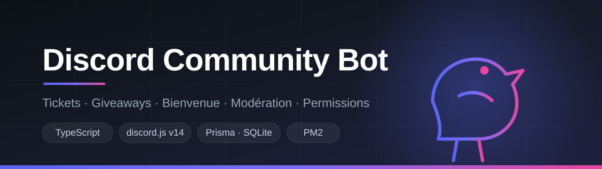

<p align="center">
  
</p>

<p align="center">
  <a href="#-fonctionnalités">Fonctionnalités</a> •
  <a href="#-installation-rapide">Installation</a> •
  <a href="#-commandes">Commandes</a> •
  <a href="#-hébergement-247-vps--pm2">Hébergement</a> •
  <a href="#-mise-à-jour">Mise à jour</a>
</p>

<p align="center">
  
  
  
  
  
</p>

---

Bot Discord de **gestion communautaire** complet : tickets avec transcripts, giveaways,
messages de bienvenue, modération, permissions internes et logs.
Multi-serveurs, données persistantes, prêt à tourner 24/7 sur un VPS.

**Préfixe par défaut :** `+` (modifiable dans le `.env`)

## ✨ Fonctionnalités

| Système | Détails |
|---|---|
| 🎫 **Tickets** | Panneau à bouton, salons privés numérotés, ajout/retrait de membres, renommage, **transcript HTML** envoyé dans les logs à la fermeture |
| 🎉 **Giveaways** | Panneau de création interactif (récompense, durée, gagnants, rôle requis/interdit), participation par bouton, **fin automatique** même après un redémarrage, reroll |
| 👋 **Bienvenue** | Message embed ou texte avec variables (`{user}`, `{server}`, `{memberCount}`…), MP d'accueil, **rôles automatiques** (jusqu'à 5) |
| 🔨 **Modération** | `kick` / `ban` multi-cibles, MP d'information avant sanction, contrôle de la **hiérarchie des rôles** et des permissions réelles |
| ⚙️ **Permissions** | 7 niveaux internes assignables à un membre **ou un rôle**, indépendants des permissions Discord |
| 📑 **Logs** | 4 catégories configurables : modération, tickets, giveaways, configuration |
| 💠 **Soutien** | Rôle attribué automatiquement quand un membre met un texte défini dans son statut personnalisé |
| 🧰 **Utilitaires** | `snipe`, calculatrice sécurisée, avatar, bannière, vol d'émoji, recréation de salon |

## 🚀 Installation rapide

> **Prérequis :** [Node.js 18.17+](https://nodejs.org) (recommandé : 20 LTS)

<details>
<summary><b>1. Créer le bot sur Discord</b> (clique pour dérouler)</summary>

1. [Discord Developer Portal](https://discord.com/developers/applications) → **New Application**
2. **General Information** → copie l'`Application ID` (= `CLIENT_ID`)
3. **Bot** → `Reset Token` → copie le token (= `DISCORD_TOKEN`) — ⚠️ ne le partage jamais
4. **Bot → Privileged Gateway Intents** → active les **3 intents** :
   `Presence Intent`, `Server Members Intent`, `Message Content Intent`
5. **OAuth2 → URL Generator** → scope `bot` + permissions
   (`Manage Channels`, `Manage Roles`, `Kick`, `Ban`, `Manage Messages`,
   `Manage Expressions`, `Embed Links`, `Attach Files`…) → ouvre l'URL → invite le bot
6. Sur ton serveur : monte le **rôle du bot au-dessus** des rôles qu'il devra gérer

</details>

```bash
# 1. Dépendances
npm install

# 2. Configuration
cp .env.example .env          # Windows : copy .env.example .env
#    → remplis DISCORD_TOKEN, CLIENT_ID et ROOT_OWNER_ID

# 3. Base de données
npx prisma migrate dev --name init

# 4. Compilation + démarrage
npm run build
npm start
```

Le bot est prêt quand la console affiche `✅ Connecté en tant que ...` → tape `+help` sur Discord.

> 💡 En développement : `npm run dev` relance le bot à chaque modification du code.

## 📋 Commandes

| Catégorie | Commandes |
|---|---|
| 🧰 Utilitaire | `+help [commande]` · `+pic [membre]` · `+banner [membre]` · `+snipe` · `+calc <calcul>` |
| 🛠️ Administration | `+say <message>` · `+mp <membre> <message>` · `+create [émoji] [nom]` · `+renew [salon]` |
| 🔨 Modération | `+kick <membre...> [raison]` · `+ban <membre...> [raison]` |
| 🎉 Giveaway | `+giveaway` · `+end giveaway <ID>` · `+reroll` |
| 🎫 Tickets | `+ticket settings` · `+rename <nom>` · `+add <membre>` · `+del <membre>` · `+close [raison]` |
| ⚙️ Configuration | `+join settings` · `+soutien` · `+logs` · `+setperm <add/remove> <niveau> <cible>` · `+perm` |
| 👑 Owner | `+owner [@membre/ID]` · `+unowner <@membre/ID>` |

**Niveaux de permission** (`+setperm`) : `ADMIN` · `MODERATOR` · `TICKETS` · `GIVEAWAY` · `SERVER`
Les owners du bot, le propriétaire du serveur et les administrateurs Discord ont toujours accès à tout.

## 🖥️ Hébergement 24/7 (VPS + PM2)

```bash
# Sur un VPS Ubuntu/Debian
sudo apt update && sudo apt upgrade -y
curl -fsSL https://deb.nodesource.com/setup_20.x | sudo -E bash -
sudo apt install -y nodejs unzip

# Dans le dossier du projet (après npm install, .env, migrate et build)
sudo npm install -g pm2
pm2 start ecosystem.config.cjs
pm2 save
pm2 startup     # exécute la commande affichée, puis refais : pm2 save
```

| Action | Commande |
|---|---|
| Statut | `pm2 status` |
| Logs en direct | `pm2 logs crow-style-bot` |
| Redémarrer | `pm2 restart crow-style-bot` |
| Arrêter | `pm2 stop crow-style-bot` |

📖 Guide pas-à-pas détaillé : **[INSTALLATION.md](INSTALLATION.md)**

## 🔄 Mise à jour

Tes données tiennent en **deux fichiers** : `.env` et `prisma/bot.db` (aucun des deux n'est versionné).

```bash
cp .env ~/.env.backup && cp prisma/bot.db ~/bot.db.backup   # sauvegarde
git pull
npm install
npx prisma migrate deploy     # n'efface jamais les données existantes
npm run build
pm2 restart crow-style-bot
```

## 🗂️ Structure du projet

```
src/
├── commands/      # Commandes classées par catégorie (utilities, admin, moderation…)
├── events/        # Événements Discord (messageCreate, guildMemberAdd, presenceUpdate…)
├── interactions/  # Boutons persistants (tickets, giveaways)
├── services/      # Logique métier (tickets, giveaways, permissions, logs, owners)
├── systems/       # Tâches de fond (fin des giveaways, statut rotatif)
├── utils/         # Helpers (embeds, resolvers, durées, cooldowns, modals)
└── config/        # Configuration et statuts
prisma/schema.prisma   # Modèle de données
```

## ⚠️ Notes importantes

- Sans **Message Content Intent**, le bot ne verra aucune commande `+`.
- `+soutien` nécessite l'intent **Presence** (seul le statut personnalisé est lisible par les bots).
- Si un rôle ne peut pas être attribué : monte le rôle du bot dans *Paramètres du serveur → Rôles*.
- Le **Root Owner** (`ROOT_OWNER_ID` du `.env`) ne peut jamais être retiré ; les autres owners se gèrent avec `+owner` / `+unowner`.
- Ne commite jamais ton `.env` ni `prisma/bot.db` (déjà exclus par le `.gitignore`).
- Token qui a fuité ? → **Reset Token** sur le Developer Portal, puis mets à jour `.env`.

## 📄 Licence

Distribué sous licence MIT — voir [LICENSE](LICENSE).
